# Docker cơ bản

## Giới thiệu

* Docker là dự án mã nguồn mở <https://github.com/docker>
* Docker là một nền tảng mã nguồn mở giúp đóng gói, phân phối và chạy ứng dụng trong các container một cách nhẹ và nhất quán trên nhiều môi trường khác nhau

## Docker được dùng để làm gì ?

* Tạo ra các container cho các ứng dụng phần mềm
* Sau khi dùng Docker build ra được các container thì Docker sẽ giúp vận chuyển các container đến các môi trường phát triển
* Hỗ trợ việc chia sẻ các container cho các lập trình viên khác

## Khẩu quyết của Docker

* ***"Build, ship and deply any application, anywhere"***
  * Build: đóng gói ứng dụng cho 1 container
  * Ship: vận chuyển container đó từ máy này sang máy khác
  * Deploy: triển khai và chạy các container
  * Any application: bất cứ ứng dụng nào chạy được trên môi trường Linux
  * Anywhere: từ môi trường phát triển trên laptop, đến máy chủ vật lý, máy ảo, cloud instance, ....
  * Đóng gói phần mềm dễ dàng
  * Component có thể deploy ngay lập tức
  * Không cần cấu hình và cài đặt môi trường phát triển rườm rà
  * Image: component để triên khai ứng dụng bao gồm mã nguồn, thư viện framework, file, ...
  * Trừu tượng hóa giải pháp và đóng gói vào 1 image kèm dependencies

* ***"Batteries included but replaceable"***

  * 1 component có thể thay thể bằng 1 component khác bằng cách implement cùng 1 interface có sẵn
  * Docker framework được phân chia thành các mô-đun có khả năng mở rộng cao. Chính vì tính mở rộng cao này nên các component có thể được thay thế bằng các component tương tự, các tính năng tương tự thậm chí còn ưu việt hơn

## Một số thuật ngữ

* Image
  * Khuôn mẫu, lớp chứa các file cần thiết để tạo nên 1 container
  * Chứa những tài nguyên có sẵn
  * Không được tiếp cận vào CPU, memory, storage, ...
* Container
  * Được xem như 1 object tồn tại trên host với 1 IP
  * Được deploy, chạy, và xóa bỏ thông qua remote clientgit
* Docker engine
  * Tạo vào chạy container
  * Chạy lệnh trong chế độ daemon
  * Linux trở thành máy chủ daemon
  * Container được deploy, chạy, xóa bỏ thông qua remote client

<p align="center">
    
</p>

```text
Qua hình bên ta thấy Docker engine nằm trên layer (hệ điều hành) và nằm dưới layer (thư viện và ứng dụng). Thư viện và ứng dụng ở đây tượng trưng là container mà docker engine đang quản lý.
```

* Docker daemon
  * Tiến trình chạy ngầm quản lý các container
* Docker client
  * Kiếm soát hầu hết các workflow của Docker
  * Giao tiếp với các máy chủ Docker thông qua daemon

<p align="center">
    
</p>

* Docker Hub (Registry)
  * Chứa các component Docker
  * Cho phép lưu, sử dụng, tìm kiếm image
  * Vai trò: **"ship"** trong **"build, ship, deploy"**

<p align="center">
    
</p>

```text
Docker Hub giúp việc vận chuyển các images từ lập trình viên này đến lập trình viên khác thông qua hệ thống quản lý Revision, tới các Integration Tests và tới các Deployment Platforms
```

## Điểm mạnh của Docker

* Deploy nhanh hơn
  * Docker images được build sử dụng hệ thống augmented file system
  * Thêm các layer bên trên root kernel
  * Dễ dàng tổng hợp các layer thành một
**=> Tạo ra 1 container mới sẽ nhanh chóng và gọn nhẹ**

  * Độc lập
    * Lỗi xảy ra với 1 container không ảnh hưởng các container khác
  * Cơ động
    * Tránh conflict môi trường
    * Trao đổi giữa các máy
    * Nhất quán khi chạy trên các máy khác nhau
  * Chụp ảnh hệ thống (snapshot)
    * Một khi 1 docker container đã chạy, chúng ta có thể lưu giữ trạng thái của nó bất cứ khi nào, lưu snapshot thành container hoặc image
    * Tag
    * Tạo container y hệt từ snapshot
  * Kiểm soát việc sử dụng tài nguyên (CPU, RAM, Storage, ...) . Vd: ***1 hành động chỉ cho phép bao nhiêu đó CPU, nếu lớn hơn mức quy định -> tắt nó đi***; ***định nghĩa hành động khi memory vượt mức quy định cho phép***

  * Đơn giản hóa sự phụ thuộc lẫn nhau giữa các ứng dụng (dependency)
    * Docker giản lược rất nhiều effort của các lập trình viên khi xác định dependency ở Dockerfile mà không cần thiết phải cài đặt từng thư viện một
  * Thuận tiện cho việc chia sẻ
    * Docker Hub (public/ private registry)
    * Dockerfile (lấy image về chạy dockerfile trên file image gốc)

## Một số lầm tưởng về Docker

1. ***Không*** phải công cụ quản lý thiết lập hay thiết lập tự động (Puppet, Chef, ...)
2. ***Không*** phải giải pháp ảo hóa phần cứng (VMWare, KVM, ...)
3. ***Không*** phải là một nền tảng điện toán đám mây (OpenStack, CloudStack, ...)
4. ***Không*** phải là một deployment framework (Capistrano, Fabric, ...)
5. ***Không*** phải là một công cụ quản lý workload (Mesos, Fleet, ...)
6. ***Không*** phải là một môi trường phát triển (Vagant, ...)

## Kernel

* Kernel chạy trực tiếp trên phần cứng và có các nhiệm vụ khác nhau:
  * Nhận tin từ phần cứng, thông báo rằng 1 ổ đĩa mới vừa được kết nối, .... -> Phản hồi các thông điệp từ phần cứng
  * Khởi tạo và đặt lịch cho các chương trình
  * Quản lý và hệ thống các tác vụ
  * Truyền tin giữa các chương trình
  * Phân chia tài nguyên, bộ nhớ, CPU, mạng, ...
  * Tạo container bằng cách chỉnh thiết lập của kernel

## Docker

* Viết bằng ngôn ngữ Go (Go, 1 trong những ngôn ngữ dành cho hệ thống)
* Quản lý nhiều đặc tính của kernel, và dùng những đặc tính đó đưa ra định nghĩa về container và image
  * ***"cgroup" - "control group"***: nhóm các tiến trình, và bao lấy các tiến trình cùng nhóm trong 1 không gian ảo riêng => các container không can thiệp lẫn nhau được
  * ***"namespace"***: 1 đặc điểm của kernel linux cho phép chia tách các tầng network
  * ***"copy-on-write"***: định nghĩa image
* Hướng tiếp cận đã tồn tại vài năm trước khi có Docker
* Docker đơn giản hóa cho việc viết script cho các hệ thống phân tán

## Socket điều khiển của Docker

* Docker bao gồm 2 phần: client và server
* Server nhận lệnh qua socket (qua mạng hoặc qua "file")
* Client thậm chí có thể được chạy bên trong Docker

### Chạy Docker ở máy Local

<p align="center">
    
</p>

```text
1 Chương trình docker client kết nối tới Socket -> gửi lệnh đến Docker Server, tiến hành các lệnh theo yêu cầu: tạo container, xóa container, ...
```

### Chạy Docker ở bên trong client

<p align="center">
    
</p>

```text
Cho phép chia sẻ socket bên trong container, gửi cùng 1 tin đi qua 1 socket tới server chạy trên host và làm các việc khác như bình thường
Và quan trọng, client có thể chạy ở bất cứ chỗ nào, và có thể kết nối tới server, làm bất cứ việc gì Docker có thể làm 
```

## So sánh Docker và virtual machine

<p align="center">
    
</p>

```text
- VM:
    + Trên phần cứng vật lý là hệ điều hành chủ
    + Tiếp theo là Hypervisor ~ có thể hiểu nó giống như 1 hệ thống quản lý VM
    + Tiếp trên đó là các hệ điều hành giả lập
    + Trong mỗi hệ điều hành giả lập này có các file hệ thống và ứng dụng
- Docker:
    + Trên phần cứng vật lý cũng là hệ điều hành chủ
    + Nhưng tiếp theo là hệ điều hành chủ thay vì Hypervisror
    + Trên đó nữa là các file hệ thống và ứng dụng
=> Mô hình của docker dường như đơn giản hơn của VM
```

|VM|Docker|
|:-:|:-:|
|Công nghệ ảo hóa|Công nghệ container hóa|
|Chạy hệ điều hành riêng bên trong môi trường phần cứng giả lập được cung cấp bởi hypervisor chạy trên phần cứng vật lý| Container hóa cho phép nhiều ứng dụng chạy trên các partition độc lập trên Linux Kernel, và chạy trực tiếp trên phần cứng vật lý|
|Kernel riêng|Kernel chung với hệ điều hành|
|Khởi động cả hệ điều hành|Khởi động 1 số process|
|Tốc độ chậm|Tốc độ nhanh|
|Cần nhiều tài nguyên|Tiết kiệm tài nguyên|

### Lựa chọn giữa Docker và VM

* VM: phân tách tài nguyên rõ ràng
* Docker: phân tách tài nguyên tương đối, ứng dụng đóng gói dễ dàng kèm dependency

## Kiến trúc Docker

<p align="center">
    
</p>

* Kiến trúc Docker được xây dựng theo mô hình client-server
* Gồm 3 thành phần chính:
  * Docker Client
  * Docker host
  * Docker Registry (Hub)
* Docker daemon hay server chịu trách nhiệm cho mọi hoạt động liên quan tới server, daemon tiếp nhận các lệnh từ client thông qua CLI hoặc REST API
* Docker client ở trên cùng host hoặc khác host với Docker daemon

<p align="center">
    
</p>

* ***image là hạt nhân cơ bản của docker, container được tạo nên từ image. image có thể được cấu hình với các ứng dụng bên trong của nó, và được sử dụng như 1 template để tạo ra container. Image được tổ chức theo kiểu layer, và mỗi thay đổi của image sẽ lần lượt được thêm vào lớp phía trên của image đó***
* Docker Registry là 1 kho lưu trữ image dùng để chia sẻ image public hoặc privae
* Docker Hub: dịch vụ lưu trữ và chia sẻ image
* Nhiều container có thể liên kết với nhau để tạo kiến trúc ứng dụng đa tầng
* Nếu đóng container mà chưa commit thì mọi thay đổi trên container đều sẽ bị mất

## Docker toolbox

* Là 1 bộ cài đặt Docker cho Windows và Mac dành cho các thiết bị không đạt yêu cầu để cài đặt bộ cài đặt mới
* Bao gồm các công cụ:
  * Docker machine: quản lý host bằng các câu lệnh docker-machine
  * Docker engine: chạy các lệnh docker
  * Docker compose: thiết lập việc chạy nhiều container trong docker
  * Kitematic: giao diện hiển thị cho docker
  * Shell thiết lập sẵn để phục vụ cho môi trường command-line trên docker
  * Oracle virtualbox: máy ảo

### Docker machine

* Công cụ giúp cài đặt Docker engine trên các host ảo
* Quản lý các host đó bằng lệnh *dokcer-machine*
* Từng là cách duy nhất để chạy Docker trên Windows và Mac trước phiên bản 1.12

### Docker machine dùng để làm gì ?

* Docker machine cho phép set up nhiều remote docker host thuộc rất nhiều các biến thể của hệ điều hành Linux.
* Thay vào đó, nó cho phép chạy docker trên các phiên bản hệ điều hành Windows hoặc Mac đời cũ
* Thoải mái tạo docker host trên các hệ thống remote
  * Docker engine chạy thuần trên Linux, nếu cài sẵn Linux ở máy và muốn chạy docker thì chỉ cần cài docker.
  * Tuy nhiên nếu muốn tìm cách hiệu quả để chạy hiệu quả nhiều docker host trên mạng riêng, trên cloud, hay ở máy local thì cần tới docker machine
  * Bất kể chạy Windows, Linux, Mac thì đều có thể cài đặt docker machine, nó sẽ tự tạo các host và cài đặt docker engine lên trên đó và cấu hình docker client
  * Mỗi host machine = 1 docker host + 1 docker client

### Dokcker engine && docker machine

<p align="center">
    
</p>

```text
- Docker Engine:
    + Mô hình client - server
    + Tạo bởi Docker daemon, REST API, docker client CLI
- Docker Machine:
    + Quản lý docker host 
    + Cài docker engine lên 1 hoặc nhiều máy ảo trên máy
```

### Docker Hub là gì ?

* Dịch vụ registry trên cloud
* Kết nối tới code repositry, build, test và deploy image
* Cung cấp tài nguyên tập trung cho việc tìm kiếm image, phân phối và quản lý các thay đổi của image
* DevOps và developer có thể dùng image 1 cách tự động và theo flow

### Tính năng Docker Hub

* Image repository: tìm kiếm, lưu trữ, push và pull image cho cộng đồng người dùng docker
* Build tự động: build những image khi có sự thay đổi code của sản phẩm
* Webhook: là 1 tính năng tự động build, webhook thông báo cho bạn biết khi có push thành công lên 1 repository
* Tổ chức: tạo nhóm làm việc để quản lý truy cập vào image repository
* Tích hợp với Github và Bitbucket

## Download Docker

* Vào trang sau [cài đặt docker](https://www.docker.com/)

### Docker for windows

* Xác định kiến trúc CPU (có thể thử 2 câu lệnh sau):
  * CMD: `echo %PROCESSOR_ARCHITECTURE%`
  * PowerShell: `[System.Environment]::GetEnvironmentVariable("PROCESSOR_ARCHITECTURE")`
* Xác định xem chế độ ảo hóa đã được bật chưa
  * Mở Task Manager `(Ctrl + Shift + Esc)` → Tab Performance → Xem "Virtualization"
    * Enabled = Đã bật
    * Disabled = Chưa bật
  * Chạy lệnh sau trong CMD:  `systeminfo | find "Hyper-V Requirements"`
    * Nếu thấy *Virtualization Enabled In Firmware: Yes*, nghĩa là ảo hóa đã bật.

## Các lệnh cơ bản trong Docker

### docker run

* Được sử dụng để chạy 1 container từ 1 image

:arrow_forward:`docker run nginx`
<p align="center">
    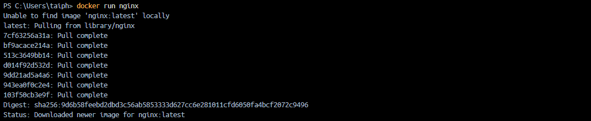
</p>

* Nếu image nginx đã có trên máy, Docker sẽ chạy một instance của nó.
* Nếu image chưa có, Docker sẽ tải từ Docker Hub về (chỉ lần đầu tiên). Những lần sau, nó sẽ tái sử dụng image có sẵn.

### docker ps

* Liệt kê tất cả các container đang chạy và 1 số thông tin cơ bản sau:
  * ID container
  * Tên image
  * Trạng thái hiện tại
  * Tên container

<p align="center">
    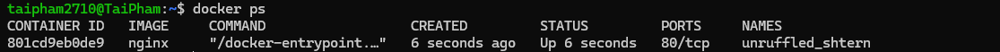
</p>

* Docker sẽ tự động đặt tên ngẫu nhiên cho container, ví dụ như: `unruffled_shtern`
  * Để xem tất cả container (bao gồm container đã dừng), dùng :arrow_right: `docker ps -a`

<p align="center">
    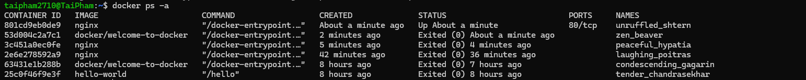
</p>

### docker stop

* Để dừng 1 container đang chạy, sử dụng :arrow_right: `docker stop <container_id> hoặc <container_name>`

<p align="center">
  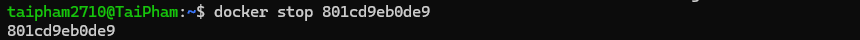
</p>

* Nếu không nhớ tên container, chạy `docker ps` để lấy danh sách
* Sau khi chạy `docker stop`, container sẽ bị tạm dừng nhưng vẫn còn tồn tại
  * Kiểm tra container đã dừng :arrow_right: `docker ps -a`

<p align="center">
  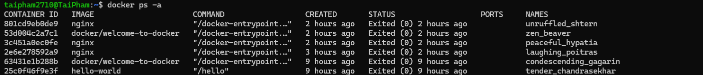
</p>

### docker rm

* Nếu không muốn container tồn tại nữa, sử dụng :arrow_right: `docker rm <container_id>`

<p align="center">
    
</p>

* Điều này sẽ xóa vĩnh viễn container
  * Kiểm tra lại bằng cách chạy `docker ps -a` để đảm bảo nó đã bị xóa vĩnh viễn

### docker images

* Để xem danh sách các images có trên máy ta sử dụng :arrow_right: `docker images`

<p align="center">
  
</p>

### docker rmi

* Để xóa 1 images không còn sử dụng, ta dùng :arrow_right: `docker rmi <image_id>`

### docker rmi

* Để xóa 1 images không còn sử dụng, ta dùng :arrow_right: `docker rmi <image_id>`

:warning: **Lưu ý:** Phải xóa các container liên quan trước khi xóa image

<p align="center">
  
  
</p>

### docker pull

* Khi chạy `docker run ubuntu` docker sẽ kiểm tra ảnh xem có ở trên máy không, nếu không có thì docker sẽ tải ảnh từ Docker Hub. Sau đó container sẽ khởi động và ngay lập tức thoát vì trong image không có dịch vụ hay ứng dụng nào chạy
* Nếu chỉ muốn tải ảnh mà không chạy container, hãy sử dụng :arrow_right: `docker pull ubuntu`. Lệnh này sẽ tải ảnh và lưu trữ ở máy, lần sau khi chạy `docker run ubuntu` nó sẽ không cần tải lại image.

<p align="center">
  
</p>

### Tại sao container lại thoát ngay lập tức ?

* Không giống như máy ảo, containers được thiết kế để chạy các tác vụ hoặc quá trình cụ thể, chứ không phải là hệ điều hành đầy đủ. Khi chạy một container từ image ubuntu, không có dịch vụ hay ứng dụng nào tự động chạy. Nếu không có quá trình nào đang chạy, container sẽ thoát ngay lập tức
* Một container sẽ sống trong suốt thời gian quá trình bên trong nó đang hoạt động. Nếu không có quá trình nào chạy, như trường hợp của image `ubuntu`, container sẽ thoát ngay lập tức

### Chạy 1 process trong docker

* Nếu muốn container chạy 1 process, ta có thể chỉ định lệnh khi chạy container. Ví dụ :arrow_right: `docker run ubuntu sleep 5`

:arrow_right: Lệnh này sẽ chạy container và lệnh `sleep 5` sẽ giữ container sống trong 5s trước khi thoát. Và sau khi thoát thì container sẽ dừng lại

<p align="center">
  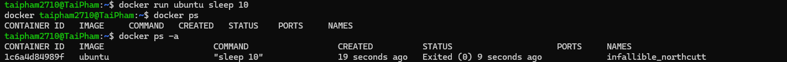
</p>

### Thực thi lệnh bên trong 1 container đang chạy

* Nếu muốn chạy một lệnh trên một container đang chạy, bạn có thể sử dụng lệnh :arrow_right: `docker exec`. Ví dụ, nếu có một container Ubuntu đang chạy và ngủ trong 200 giây, ta có thể thực thi lệnh bên trong container như sau:

<p align="center">
  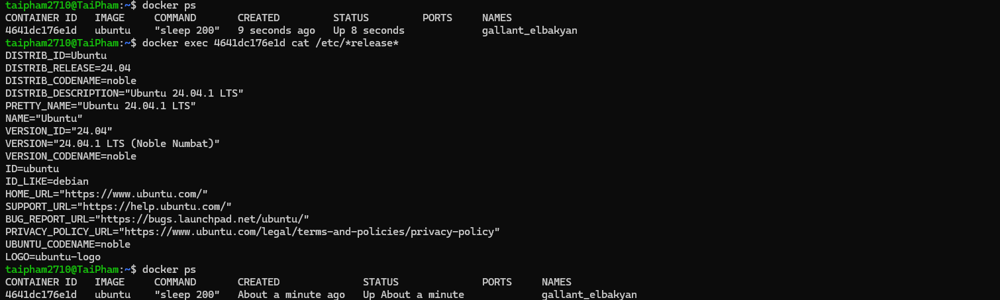
</p> 

* Lệnh này sẽ thực thi lệnh cat /etc/*release* bên trong container và in ra nội dung của tệp /etc/*release*

### Chạy container ở chế độ Foreground

:arrow_right: `docker run kodecloud/simpleweb-app`

:arrow_right: Container sẽ chạy ở chế độ foreground, có nghĩa là ta sẽ được gắn vào đầu ra của container. Ta sẽ thấy đầu ra của dịch vụ web trên màn hình, nhưng ta sẽ không thể làm gì khác trên terminal cho đến khi container dừng lại. Bạn có thể dừng container bằng cách nhấn Ctrl + C

### Chạy container ở chế độ Detached

* Để chạy container ở chế độ background và trở lại với terminal ngay lập tức, ta có thể sử dụng tùy chọn `-d`:

:arrow_right: `docker run -d kodecloud/simpleweb-app`

* Lệnh này sẽ chạy container ở chế độ detached (background), cho phép ta tiếp tục sử dụng terminal. Container sẽ tiếp tục chạy trong nền

### docker attach

* Lệnh docker attach giúp ta gắn lại vào terminal của một container đang chạy, để ta có thể theo dõi hoặc tương tác với nó

<p align="center">
  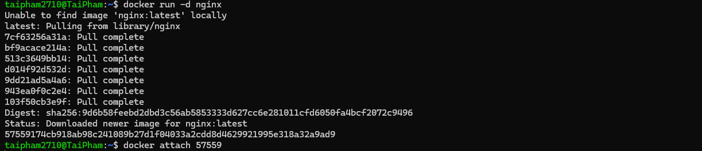
</p>

* Sau đó, ta sẽ thấy đầu ra của container như thể bạn đang chạy nó trong chế độ foreground. Nếu nhấn `Ctrl + C`, container sẽ bị dừng. Nếu bạn chỉ muốn thoát khỏi phiên mà không dừng container, hãy nhấn tổ hợp phím: `Ctrl + P, sau đó Ctrl + Q` 
  * Lúc này, bạn sẽ thoát khỏi phiên `attach`, nhưng container vẫn tiếp tục chạy trong nền 
  
## Docker Run

### Chạy container với 1 phiên bản cụ thể của ứng dụng (RUN TAG)

* Khi chạy lệnh `docker run redis`, Docker mặc định sẽ chạy phiên bản mới nhất (latest: Redis version=7.4.2)

<p align="center">
  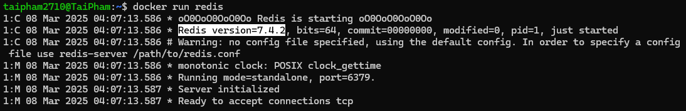
</p>

* Nếu muốn chạy phiên bản redis khác ta sử dụng :arrow_right: `docker run redis:4.0`. Trong đó, `4.0` là tag chỉ định phiên bản redis cần chạy
* Nếu không chỉ định phiên bản nào, docker sẽ mặc định lấy `latest`
* Để xem danh sách các phiên bản có sẵn, ta truy cập vào [docker hub](https://hub.docker.com/)

### Chạy container ở chế độ tương tác (RUN STDIN)

* Khi chạy một ứng dụng có nhập dữ liệu từ bàn phím, container sẽ không tự động hiển thị lời nhắc nhập.
  * Ví dụ: Một ứng dụng yêu cầu nhập tên, nhưng khi chạy bằng Docker, nó không hiển thị gì mà chỉ nhận dữ liệu.
  * Nguyên nhân: Docker mặc định chạy ở chế độ không tương tác (không có terminal).
  * Giải pháp:
    * -i (interactive): Giúp container nhận dữ liệu từ bàn phím.
    * -t (pseudo terminal): Kết nối container với terminal của máy host.

* Giả sử có một đoạn code python sau:

```python
name = input("Nhập tên của bạn: ") # nhập vào từ bàn phím
print(f"Xin chào, {name}!")
```

**Nếu chạy trên máy thường thì sẽ in ra như sau:**

```text
Nhập tên của bạn: Tài 
Xin chào, Tài!
```

**Các trường hợp chạy với docker:**

:one: `docker run python myscript.py`

```text

Xin chào, !
```

:two: `docker run -i python myscript.py`

```text
Tài
Xin chào, Tài!
```

:three: `docker run -it python myscript.py`

```text
Nhập tên của bạn: Tài
Xin chào, Tài!
```

**Lý do:**

* Docker mặc định chạy container trong chế độ không có terminal, nên nó không hiển thị đầu ra của `input()`.
* Container vẫn có thể nhận dữ liệu, nhưng bạn không thấy lời nhắc nhập, làm bạn không biết cần nhập gì.

**Tóm lại:**

* Nếu ứng dụng bắt buộc phải nhập từ bàn phím như `input()` thì phải dùng `-it`
  * Nếu không có `-i` thì sẽ không thể nhập dữ liệu
  * Nếu không có `-t` thì chương trình có thể chạy nhưng không có không thể hiển thị lời nhắc nhập
  * Khi dùng `-it` docker sẽ chạy như 1 terminal và chờ chúng ta nhập vào

### Mở cổng (port mapping) để truy cập container từ bên ngoài (RUN -PORT)

Giả sử có một ứng dụng web chạy trong Docker container, lắng nghe (listen) trên port 5000.
Nếu chạy container bằng lệnh: `docker run mywebapp`
Ứng dụng có thể chạy bình thường bên trong container, nhưng bạn không thể truy cập nó từ trình duyệt bên ngoài.
**Lý do:**
:one: Docker container có IP riêng

* Mỗi docker container có 1 IP nội bộ (vd: 127.0.0.1)
* Chỉ có thể truy cập nếu chạy trong docker host
* Nếu mở trình duyệt trên docker host, ta có thể vào: `http://172.17.0.2:5000`
* Nhưng nếu ta mở bằng 1 máy khác trong mạng, ta sẽ không truy cập vào được vì đây là IP nội bộ

:two: Cần ánh xạ(mapping) port để có thể truy cập từ bên ngoài

* Muốn truy cập từ bên ngoài, :arrow_right: cần ánh xạ port của container với port của docker host

**Dùng port mapping (-p hoặc -P):**

:hammer: Ánh xạ cổng cụ thể (**-p host_port:container_port**)

`docker run -p 8080:80 docker/welcome-to-docker`

:pushpin: Điều này có nghĩa là:

* Trình duyệt truy cập vào `http://localhost:8080` sẽ chuyển hướng đến `http://172.17.0.2:80` bên trong container
* Người dùng có thể truy cập ứng dụng từ bên ngoài `http://192.168.1.2:8080`

:hammer: Tự động ánh xạ port (**-P**)

* Nếu ta muốn docker chạy 1 port ngẫu nhiên trên docker host, ta có thể dùng `-P` (viết hoa)
`docker run -P docker/welcome-to-docker`
* Ta có thể kiểm tra docker đang chạy ở port nào bằng `docker ps`

**Tại sao cần port mapping**

* Giúp truy cập ứng dụng từ bên ngoài Docker container
* Cho phép chạy nhiều container cùng 1 ứng dụng trên nhiều port khác nhau
* Ví dụ:
  * Một container MySQL trên port 3306 `(docker run -p 3306:3306 mysql)`
  * Một container MySQL khác trên port 8306 `(docker run -p 8306:3306 mysql)`

:x: Ta không thể ánh xạ nhiều container vào cùng 1 port trên docker host

```sh
docker run -p 3306:3306 mysql
docker run -p 3306:3306 mysql  ❌ (sẽ bị lỗi vì port 3306 đã được sử dụng)
```

### Lưu trữ dữ liệu lâu dài (RUN - Volume mapping)

* Dữ liệu bên trong container sẽ bị mất nếu container bị xóa
* Ví dụ: nếu chạy MySQL bên trong docker, dữ liệu của database nằm trong `/var/lib/mysql` của container
* Để giữ dữ liệu ngay cả khi container bị xóa, ta gắn 1 thư mục trên host vào thư mục trong container bằng tùy chọn `-v`

```sh
docker run -v /opt/datadỉr:/var/lib/mysql mysql
```

  * */opt/datadir*: Thư mục trên host
  * */var/lib/mysql*: Thư mục trong container
  * Khi container bị xóa dữ liệu vấn còn trong */opt/datadir*

### Kiểm tra thông tin container (Inspect Container)

* Lệnh `docker ps` chỉ hiển thị thông tin cơ bản (tên, ID, trạng thái).
* Muốn xem chi tiết cấu hình container, ta dùng:

```sh
docker inspect <container_id>
```

:arrow_right: Kết quả trả về dạng JSON chứa trạng thái, cấu hình mạng, volume, v.v.

<p align="center">
  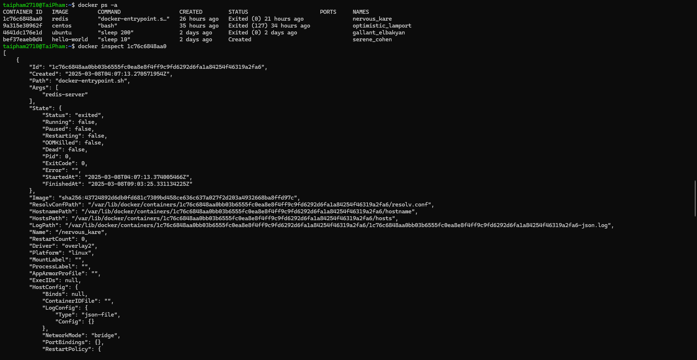
</p>

### Xem log container (docker logs)

* Nếu container chạy detachted mode `-d` ta sẽ không thấy log của nó
* Để xem log của 1 container: `docker logs <container_id> or <name>`

<p align="center">
  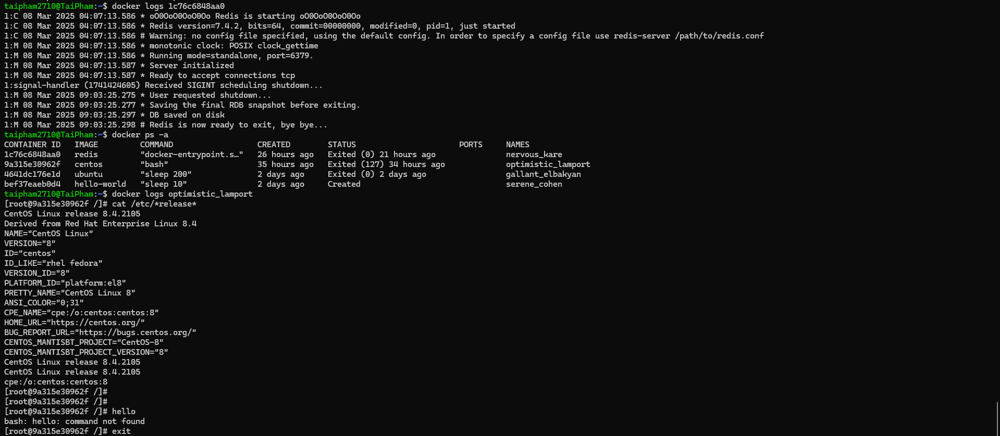
</p>